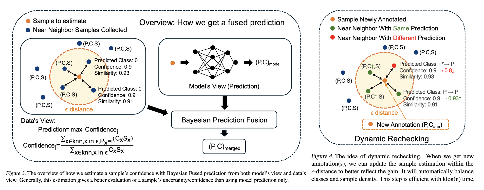

<h2 align="center">Info-Coevolution</h2>
<p align="center"><b>ICML 2025</b> | <a href="https://arxiv.org/abs/2506.08070">[Paper]</a> | <a href="https://github.com/NUS-HPC-AI-Lab/Info-Coevolution">[Code]</a> </p>

Info-Coevolution is an efficient framework for online data/annotation selection to improve data/annotation efficiency. It can be used as either active learning or coreset selection. It is a practical method for real usage, requiring much less model updates during selection and can be easily incorperated into real world data pipeline with batch selection mode. E.g. it can take <=4 times of model update for ViT on ImageNet-1k, sums to less than 100% training cost, batched sample selection for annotation, and get 32% annotation saved without performance loss. With predefined stop criterion, it can self stop without tuning the ratio.



## News
[2025/5/1] Info-Coevolution is accpted to ICML 2025!


## Contents
- [Usage](#Usage)
- [Citation](#citation)

## Usage

The data structures are defined in build_index.py, and core code usage is demonstrated in select_samples.ipynb. Adding and modify the two files to your model path would allow you to easily use them.

An example of using Info-Coevolution with FixMatch under <a href="https://github.com/microsoft/Semi-supervised-learning">Unified Semi-supervised learning Benchmark</a> codebase is shown in fixmatch_cifar10_exmaple.ipynb.

## Citation
```bibtex
@inproceedings{
    qin2025infocoevolution,
    title={Info-Coevolution: An Efficient Framework for Data Model Coevolution},
    author={Ziheng Qin and Hailun Xu and Wei Chee Yew and Qi Jia and Yang Luo and Kanchan Sarkar and Danhui Guan and Kai Wang and Yang You},
    booktitle={Forty-second International Conference on Machine Learning},
    year={2025},
    url={https://openreview.net/forum?id=VLVS8c53vZ}
}
```